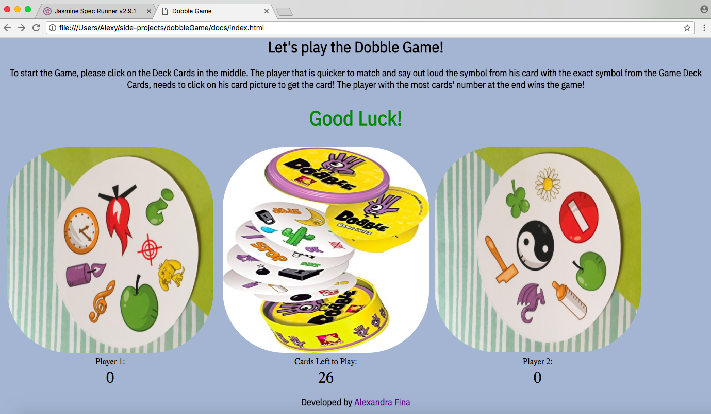
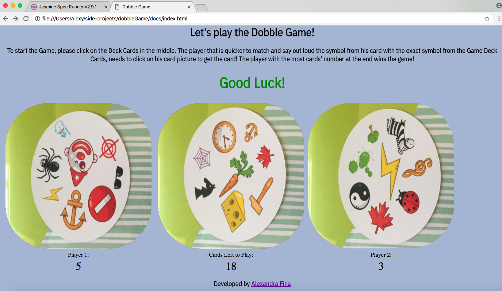

## Dobble Game (JavaScript)

## How to play:

```
To start the Game, please click on the Deck Cards in the middle. The player that is quicker
to match and say out loud the symbol from his card with the exact symbol from the Game Deck Cards,
needs to click on his card picture to get the card! The player with the most cards' number
at the end wins the game!
```

## How to play using command line (the deck cards change is quicker)

1. On your command line type ``` git clone git@github.com:AlexandraGF/dobbleGame.git ```
2. Then change the directory by typing ``` cd dobbleGame/docs ```
3. Type ``` open index.html ``` and your browser will open the game.
4. Enjoy!

## How to play directly on the internet (the deck cards change is slower)

1. Open your browser and type ``` https://alexandragf.github.io/dobbleGame/ ```
2. Enjoy!

## How to run the tests (Jasmine testing)

1. On your command line type ``` git clone git@github.com:AlexandraGF/dobbleGame.git ```
2. Then change the directory by typing ``` cd dobbleGame/docs/jasmine ```
3. Type ``` open SpecRunner.html ``` and your browser will open the passing tests.

## Screenshots from the Game




